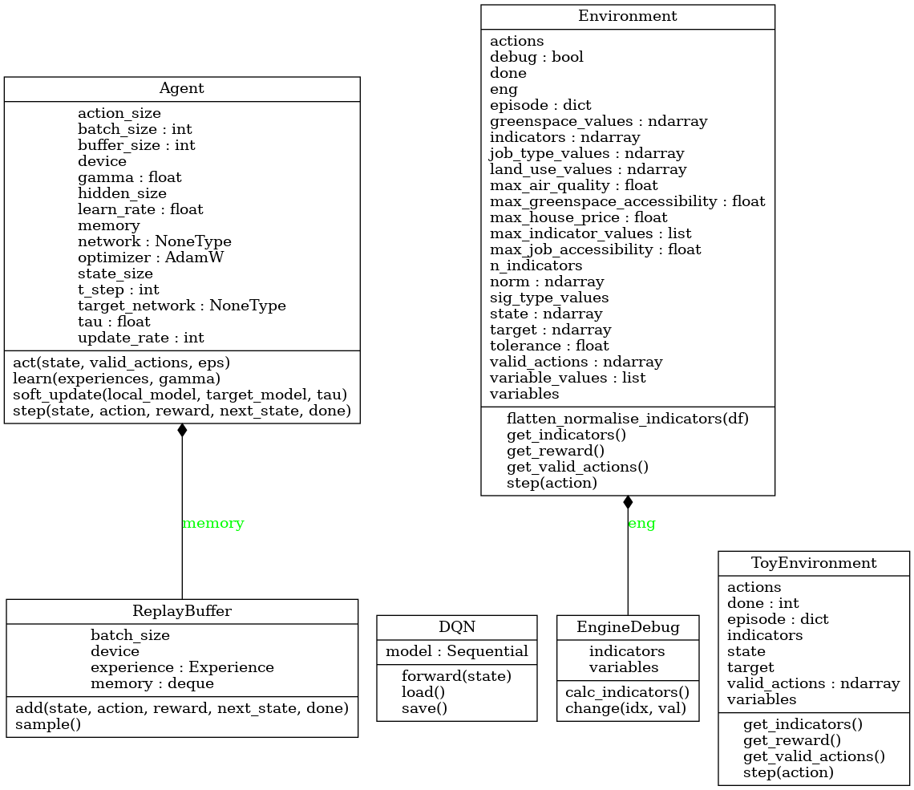
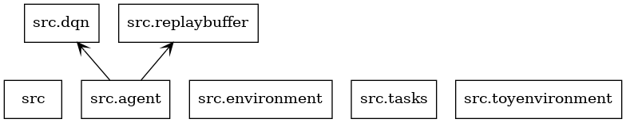
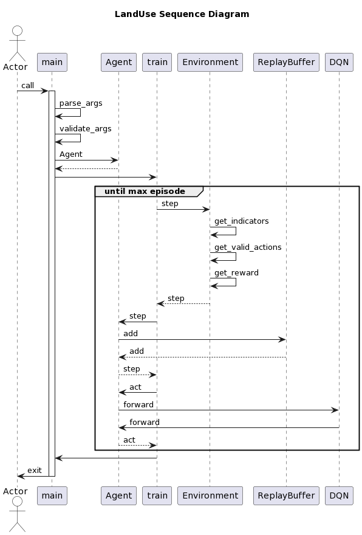

## Install

Create a virtual environment, either with venv or conda, with Python 3.10.* (ex. `conda create -n NAME python=3.10`) and activate it.

Install the requirements with `pip install -r requirements.txt`.

## Usage

To train the model:

```
python main.py [--seed=SEED] [-vv]
```

- SEED is an optional integer for reproducibitily (it is used to seed the `random` and `torch` modules).
- `-v` sets the logging mode to `INFO` and `-vv` to `DEBUG`. Select at least `-v` otherwise only warnings, errors and critical errors will be printed.

## Unit tests

To run the unit tests:

```
python -m unittest -v
```

## Code coverage

To measure code coverage install the package with `pip install coverage` and then

```
coverage run -m unittest discover
coverage report -m
```

For a nicer presentation, use `coverage html` and open `htmlcov/index.html` in your browser.

To erase previously collected coverage data run `coverage erase`.

###  baskerville

Login to baskeville:

 
 
launch notebook:
 
 
 

```bash
ln -s /bask/projects/v/vjgo8416-geo-com-dem ~/geo-com-dem
cd ~/geo-com-dem
git clone https://gitlab.bham.ac.uk/hartleys-landuse-turing-msa-1/brainstorming.git
cd brainstorming
bask_run.sh
```
### Appendix 

#### Classes for Python

 

#### Packages for Python

 

#### Sequence Diagram

 