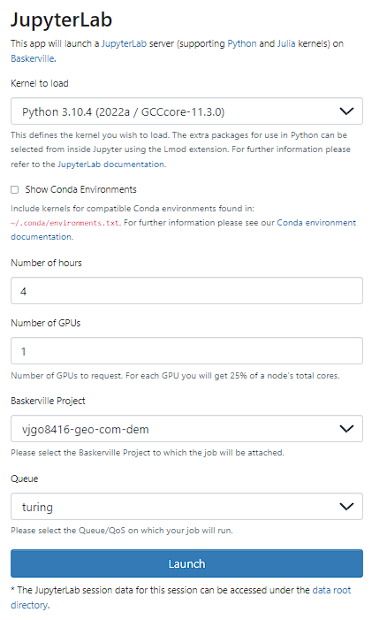

## Usage on Baskerville

Login to baskeville:

 
 
launch notebook:
 
 
 

```bash
ln -s /bask/projects/v/vjgo8416-geo-com-dem ~/geo-com-dem
cd ~/geo-com-dem
git clone https://gitlab.bham.ac.uk/hartleys-landuse-turing-msa-1/brainstorming.git
cd brainstorming
bask_run.sh
```

## Local installation

Create a virtual environment, either with venv or conda, with Python 3.10.* (ex. `conda create -n NAME python=3.10`) and activate it.

Install the requirements with `pip install -r requirements.txt`.

## Unit tests

To run the unit tests:

```
python -m unittest -v
```

## Code coverage

To measure code coverage install the package with `pip install coverage` and then

```
coverage run -m unittest discover
coverage report -m
```

For a nicer presentation, use `coverage html` and open `htmlcov/index.html` in your browser.

To erase previously collected coverage data run `coverage erase`.

