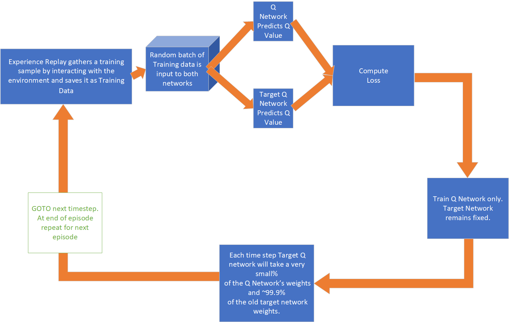

# Technical Description of the Algorithm

The source files, installation and packaging of the algorithm are described in the repository README file (see the class diagrams and sequence diagram). This document describes the algorithm itself.

## Introduction

The algorithm is based on the following assumptions.

There are 719 areas based on geographic divisions from Newcastle Upon Tyne, each with four variables of interest:

* Signature Type, int range 0-15
* Land Use, real range -1..1, discretised into 21 points
* Green Space, real range 0..1, discretised into 11 points
* Job Type, real range 0..1, discretised into 11 points 

The Turing Institute have provided a Black Box algorithm that can return four indicators of interest. Each indicator is assigned a hard-coded maximum value for normalisation purposes:

* Air Quality
* House Prices
* Job Accessibility
* Green Space Accessibility

Given initial indicators for each area, the algorithm will attempt to find a set of weights for each variable that will maximise the four indicators of interest, by minimising the difference between the initial and final indicators, using a Q Learning approach with a Deep Neural Network (DNN). The reason for using a DNN with Q Learning is so that the DNN can act as a function 'approximator' instead of storing a table of Q values for each state-action pair. This is necessary because the number of states is too large to store in memory and scales exponentially with the number of variables.

## The DQN Algorithm

The DQN algorithm can be summarised in the following diagram.



## The Classes Used in the Algorithm

The algorithm is implemented in Python. The following classes are used.


## The Sequence of Events for the Algorithm

The class and method calls for the algorithm are shown in the following sequence diagram.

 

The box labelled `until max episode` describes the sequence that is key to understanding the implementation of the algorithm. This box is refers to the loop that is defined with the following code:

```python

    # Start the episodes loop to train
    for i_episode in range(1, num_episodes + 1):
```

First, a target is selected from one of seven target text files, provided by the Turing Institute. The train function is called using an Epsilon Greedy Policy. The epsilon value decreases over time in order to reduce the amount of exploration and increase the amount of exploitation. This allows the selection of the best action for a given state, based on the current Q values.

The `step` function places `Experience` into the replay buffer. The size of the buffer is set to 32 and is designed to break the correlation between consecutive experiences. The `learn` function samples a batch from the replay buffer and updates the Q values using the Bellman equation. The weights and biases of the DQN are updated using mini batch gradient descent across the network. The loop ends when the maximum number of episodes has been reached, or the network is determined to have finished/converged if this happens earlier.

## Modifying the Algorithm

### Number of Areas

This is set to 719 in the code, to match the data supplied by the Turing Institute. The code can be modified to use a different number of areas, but the data will need to be modified to match.

### Number or Output Areas

This is set to 4 in the code (x 2 to represent increase/decrease), to match the `actions` supplied by the Turing Institute. The code can be modified to use a different number of output areas, but the data will need to be modified to match.


### Number of Input Areas

This is set to 4 in the code, to match the `states` supplied by the Turing Institute. The code can be modified to use a different number of input areas, but the data will need to be modified to match.